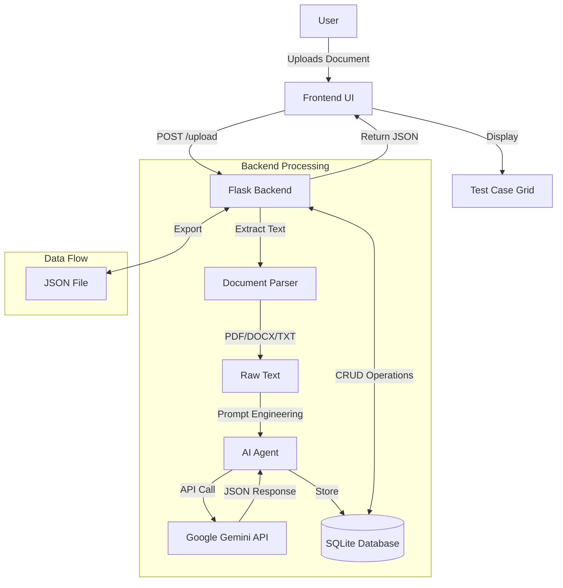

# System Architecture

## Component Breakdown

### 1. Frontend (Client-Side)
- **HTML5/CSS3**: Modern, responsive interface with dark mode.
- **JavaScript (Vanilla)**: Handles file uploads, API communication, and dynamic DOM updates.
- **Features**: Drag-and-drop upload, real-time status updates, modal editing.

### 2. Backend (Server-Side)
- **Flask**: Lightweight Python web framework.
- **Document Parsers**:
  - `PyPDF2`: Extracts text from PDF files.
  - `python-docx`: Extracts text from Word documents.
- **Database**: SQLite for local storage of generated test cases.

### 3. AI Integration
- **Google Gemini Pro**: The core intelligence engine.
- **Prompt Engineering**: Custom system prompts to ensure structured JSON output.
- **Context Window**: Handles large requirement documents.

### 4. Data Structure
Each test case contains:
- `id`: Unique identifier
- `test_case_name`: Summary of the test
- `description`: Detailed explanation
- `preconditions`: Setup requirements
- `test_steps`: Step-by-step execution guide
- `expected_result`: Validation criteria
- `priority`: High/Medium/Low
- `test_type`: Functional/Integration/etc.
